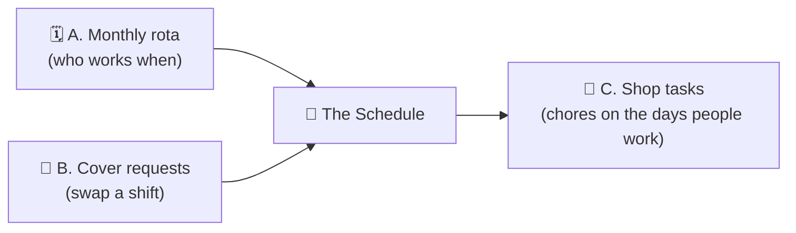
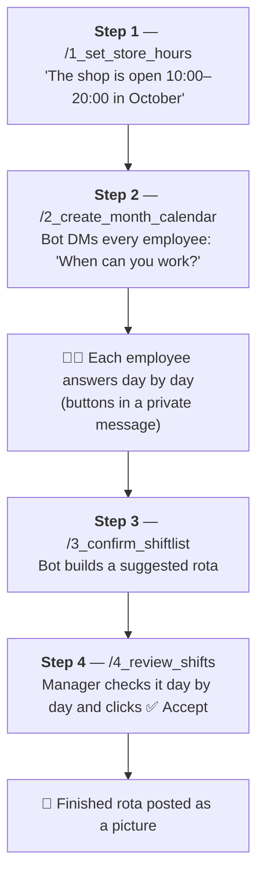
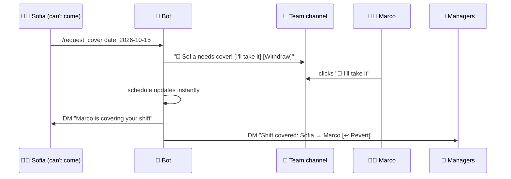
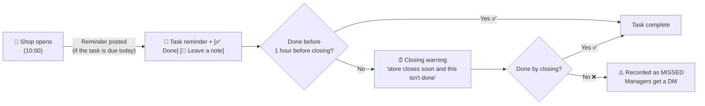

# 🏬 HBB Bot — How It Works

> **A Discord bot that runs a shop's work rota and daily chores, so managers don't have to.**
> This page explains every feature, the full workflow, and shows examples — in plain words. 
>

---

## 📖 Table of contents

1. [What is this bot? (the 30-second version)](#1--what-is-this-bot-the-30-second-version)
2. [Who does what](#2--who-does-what)
3. [The big picture](#3--the-big-picture)
4. [Part A — Building the monthly rota](#4--part-a--building-the-monthly-rota)
5. [Part B — When life happens: swapping shifts](#5--part-b--when-life-happens-swapping-shifts)
6. [Part C — Shop tasks & reminders](#6--part-c--shop-tasks--reminders)
7. [Every command in one table](#7--every-command-in-one-table)
8. [How the "smart" scheduling decides](#8--how-the-smart-scheduling-decides)
9. [Safety, privacy & memory](#9--safety-privacy--memory)
10. [FAQ](#10--faq)
11. [Glossary](#11--glossary)

---

## 1. 🍼 What is this bot? (the 30-second version)

Imagine a shop with a few employees. Every month someone has to answer:

- *"Who works which day, and at what time?"*
- *"Is the shop always covered by at least two people?"*
- *"Sarah can't come Thursday — who can take her shift?"*
- *"Did someone water the plants / mop the floor today?"*

Normally that's a messy pile of WhatsApp messages and spreadsheets.

**HBB Bot does all of it inside Discord.** You talk to it with **slash commands** (like `/my_calendar`) and **buttons** (like ✅ Accept). It:

| It… | So that… |
|---|---|
| 📩 **Asks every employee** which days they can work | Nobody has to chase anybody |
| 🧠 **Builds a fair rota automatically** | Everyone gets roughly the hours they asked for |
| 👀 **Lets a manager review it day by day** | A human always has the final say |
| 🖼️ **Draws the rota as a picture** | Everyone can see it at a glance |
| 🙋 **Handles "can someone cover me?"** | First person to click takes the shift |
| 🔔 **Reminds people of shop chores** | Things don't get forgotten |
| 📊 **Reports who did (and missed) what** | Managers see the truth at month end |

---

## 2. 👥 Who does what

There are only **two kinds of people** for the bot:

| Role | Who | What they can do |
|---|---|---|
| 👑 **Shift Manager** | A small, fixed list of people (the bosses) | Everything — set hours, build & approve the rota, fix mistakes, see reports |
| 🧑‍💼 **Employee** | Everyone on the shop's staff roster | Say when they're free, view their schedule, ask for cover, do tasks |

If a non-manager tries a manager-only command, the bot simply answers **"❌ Access denied"**.

---

## 3. 🗺️ The big picture

The bot has **three jobs**. They are independent, but share the same calendar.



- **A. Monthly rota** → build the month once, at the end of the previous month.
- **B. Cover requests** → happen any time during the month.
- **C. Tasks** → run automatically every single day while the shop is open.

The bot also **remembers everything** in a file on the computer where it runs, so if it restarts, nothing is lost.

---

## 4. 🗓️ Part A — Building the monthly rota

This is the heart of the bot. It is a **4-step recipe**. The commands are even **numbered** so you can't get the order wrong.



### Step 1 — Tell the bot when the shop is open

The manager types:

```
/1_set_store_hours  year: 2026  month: 10  opening: 10:00  closing: 20:00
```

The bot is forgiving with times: `9`, `9:30`, `09:00`, `9.5` all work.
It answers:

> ✅ **Store hours set for October 2026**
> Opening: 10:00
> Closing: 20:00
> You can now create the month calendar with `/2_create_month_calendar`

> 💡 *Why first?* Everything else (shifts, task reminders, "are we staffed?") is measured against opening hours.

---

### Step 2 — Ask everybody when they can work

```
/2_create_month_calendar  year: 2026  month: 10
```

Two things happen:

1. A **status message** appears in the team channel, showing who has answered and who hasn't (it updates live).
2. Every employee gets a **private message (DM)** from the bot.

#### What the employee sees (one day at a time)

```
📅 2026-10-14 (Wednesday) - Day 14/31
Store hours: 10:00 - 20:00

_Not answered yet_

[ ✅ Available ]  [ ❌ Not available ]  [ ⭐ Custom hours ]
[ ⬅️ Back ]
```

| Button | Meaning | Example |
|---|---|---|
| ✅ **Available** | "Use me any time that day." | Sofia is free all Wednesday |
| ❌ **Not available** | "Don't schedule me." | Marco has a dentist appointment |
| ⭐ **Custom hours** | "Only these hours." | Luca can only do 14:00–18:00 |

**⭐ Custom hours** opens a little form. You can type it many friendly ways:

```
14:00-18:00          ← normal
14-18                ← short
14:00 – 18:00        ← with spaces / fancy dash
11:00-12:00, 14:00-17:00   ← a split day (up to 3 blocks)
```

You can press **⬅️ Back** to change a previous day.

After the last day, the bot asks for two **monthly targets**:

| Question | Example answer | Why it matters |
|---|---|---|
| **Preferred total hours** for the month | `120` | The bot tries to get close to this |
| **Max days per week** (1–7) | `4` | The bot will never go above this on purpose |

Then: **"✅ Preferences submitted successfully! Thanks."** 🎉
The bot even tells them their *most frequent days* based on their answers.

> 🔁 Changed your mind, or the bot restarted? Use `/submit_preferences` to reopen your form. It **continues from the first unanswered day** — no progress lost.

#### When everybody has answered

The bot automatically:

- 📩 DMs the managers: *"All employee preferences submitted! Use `/3_confirm_shiftlist`…"*
- 🖼️ Posts an **availability picture** — a calendar showing who is free when. (If someone is away for two weeks, you *see* it instantly instead of reading 31 answers.)

---

### Step 3 — Let the bot build a draft

```
/3_confirm_shiftlist  year: 2026  month: 10
```

The bot thinks for a few seconds, then posts a summary like:

> ✅ **Suggested shift list generated for October 2026**
>
> 31 day(s) processed, aiming for 2 staff on the floor at all times.
>
> ⚠️ **3 day(s) fall below 2 staff** for at least part of the day.
> These are flagged during review — use **➕ Add employee** on those days to fill them manually.
>
> ℹ️ Hit their weekly day limit: Marco
>
> Run `/4_review_shifts` to review and accept.

The important rule: **at least 2 people must be in the shop at every minute it is open.**
If the bot *can't* reach that (not enough people said "available"), it **doesn't cheat** — it leaves the hole and **warns the manager** so a human can fix it. (More on how it decides in [section 8](#8--how-the-smart-scheduling-decides).)

> 📝 This is only a **suggestion**. Nothing is official yet.

---

### Step 4 — The manager reviews, day by day

```
/4_review_shifts  year: 2026  month: 10
```

The manager gets **one message that changes as they click** — it walks through the month one day at a time. Here's what a day looks like:

```
📅 2026-10-14 (Wednesday) — Day 14/31
🏬 Store open 10:00–20:00
━━━━━━━━━━━━━━━━━━━━
BOT SUGGESTION
• Sofia   10:00–15:00   ✅
• Luca    14:00–18:00   ⭐
• Marco   15:00–20:00   ✅

Day timeline (who is on the floor):
10:00–14:00  Sofia                (only 1! ⚠️)
14:00–15:00  Sofia, Luca
15:00–18:00  Luca, Marco
18:00–20:00  Marco                (only 1! ⚠️)

Not working: Anna ❌ (said not available)
━━━━━━━━━━━━━━━━━━━━
This week so far: Sofia 12h / 20h · Luca 8h / 16h · …

[ ✅ Accept ] [ ➕ Add employee ] [ ⬅️ Previous day ] [ ⏭️ Next day ]
[ ✏️ Sofia ] [ ✂️ Sofia 10:00-15:00 ] [ ✏️ Luca ] [ ✂️ Luca 14:00-18:00 ] …
```

*(The exact layout above is illustrative; the real message follows this pattern.)*

#### What each button does

| Button | What happens |
|---|---|
| ✅ **Accept** | Makes that day **official** and moves to the next day |
| ⏭️ **Next day** | Moves on **without** accepting (the suggestion stays a suggestion) |
| ⬅️ **Previous day** | Goes back |
| ➕ **Add employee** | Put someone on the day yourself, choosing their hours (great for fixing ⚠️ gaps) |
| ✏️ **Name** | Retype that person's whole day — or clear it to take them off |
| ✂️ **Name 10:00-15:00** | **Split** a shift: carve out part of it and hand it to someone else |

#### The little marks next to names

| Mark | Meaning |
|---|---|
| ✅ | They said "available all day" — the bot picked their hours, so it's **safe to change** |
| ⭐ | They gave **custom hours** — it's a promise they made; changing it breaks a commitment |
| ❌ | Scheduled even though they said "not available" (spotted for you) |
| ⛔ | They've hit their weekly share / limit |
| 🚫 | They're over it |

#### A split-shift example ✂️

*Problem:* Sofia works 10:00–15:00, but she needs to leave at 12:00.

1. Manager clicks **✂️ Sofia 10:00-15:00**.
2. A form asks *"Where do you want to split?"* → types `12:00`.
3. A menu asks *"Who takes 12:00–15:00?"* → picks Marco.
4. ✅ Sofia now works 10:00–12:00, Marco works 12:00–15:00.

Every change **updates the gap warnings and the weekly totals immediately**.

> 🛟 **Safety net:** while a day is still a suggestion, edits only change the *draft*. If you mess up, just don't accept it. And even accepted days can still be fixed later — the bot keeps the hour counters in step.

#### When the last day is done 🎉

The bot posts:

> ✅ **October 2026 review complete** — the finished month is attached.
>
> **FINAL MONTH TOTALS (committed):**
> • **Sofia**: target 120.0h / 118.5 hours
> • **Luca**: target 100.0h / 104.0 hours
> • **Marco**: target 80.0h / 88.0 hours — ⚠️ 5 days in one week (max 4)
>
> Need it again later? `/generate_image_calendar`.

…with the **whole month as a colour-coded picture** attached. (Each person gets their own colour; a split day is stacked inside one box.)

---

### 🔧 Manual fixes at any time

Not everything needs the review screen. Two quick commands for managers:

```
/5_assign_shift  date: 2026-10-14  employee: @Sofia  start: 9  end: 13
/6_remove_shift  date: 2026-10-14  employee: @Sofia  start: 11  end: 13
```

- `5_assign_shift` **adds** hours. If the person already works that day, it **extends** it (so you can build a split day block by block).
- `6_remove_shift` **removes** hours. Leave start/end empty to take them off the whole day, or give a range to remove only part of it.

### 👀 Everyday viewing commands

| Command | What you get |
|---|---|
| `/my_calendar year:2026 month:10` | Your own shifts, hours per day, and a monthly total |
| `/generate_image_calendar year:2026 month:10` | The whole team rota as a picture |

Example `/my_calendar` answer:

```
📅 Your Schedule - October 2026

2026-10-05 (Monday): 10:00-15:00 (5.0 hours)
2026-10-07 (Wednesday): 14:00-20:00 (6.0 hours)
2026-10-14 (Wednesday): 10:00-15:00 (5.0 hours)

Total: 16.0 hours over 3 day(s)
```

---

## 5. 🙋 Part B — When life happens: swapping shifts

*"I can't work Thursday!"* — Employees don't know **who** is free, so the bot doesn't make them guess.



### How to ask

```
/request_cover  date: 2026-10-15
                hours: 11:00-15:00        (optional — default: your whole shift)
                reason: doctor's visit    (optional — shown to the team)
```

The bot checks you *actually work* that day (and those hours) before posting.
You can only have **one open request per day**.

### What the team sees

```
🙋 Sofia needs cover

When: Thursday 15 October
Hours: 11:00-15:00 (4.0h)
Reason: doctor's visit

First to take it gets the shift — the schedule updates straight away.

[ 🙋 I'll take it ]  [ ✖️ Withdraw ]
```

### Rules when someone clicks "I'll take it"

The bot says ❌ if:

- it's **your own** shift (use *Withdraw* instead),
- somebody **already took it**,
- you're **not on the staff roster**,
- you **already work overlapping hours** that day (nobody can be in two places),
- the schedule **changed** since the request (the requester no longer works those hours).

Otherwise ✅ **the shift moves immediately** — no waiting for a manager.

### After it's taken

- The message becomes: *"✅ **Covered** — Marco is working 11:00-15:00 · ⚡ Claimed in **2 min**"*
- Managers get a DM. It even warns **"⚠️ over their limit"** if Marco is now above his max days that week.
- Managers have a **↩️ Revert** button. If it was a bad trade, one click puts everything back and re-opens the request.
- The requester can **✖️ Withdraw** any time *before* someone takes it (a manager can too).

### 🏆 The scoreboard

Covering is a favour, and favours go unnoticed — so the bot keeps score!

```
/cover_scoreboard            ← this month
/cover_scoreboard year: 2026 month: 9
```

```
🥇 Marco — 4 covers · 16.0h · fastest 1 min
🥈 Luca  — 2 covers ·  8.0h · fastest 6 min
🥉 Sofia — 1 cover  ·  3.0h · fastest 40 min
```

Ranking = **most covers first**; ties broken by **who answered fastest**.
*(Layout illustrative.)*

---

## 6. 🔔 Part C — Shop tasks & reminders

Besides the rota, the bot runs **recurring chores** ("water the plants", "mop the floor", "check the fridge temperature").

### The 3 kinds of task

| Kind | Who sees it | Who can do it | How it's reminded |
|---|---|---|---|
| 🌍 **Public task** | Everybody | **Anyone working that day** | Posted in the team channel |
| 🔒 **Personal task** | Only its creator + the people assigned | Those people | Private DM |
| 📋 **Advanced task** | Only the people on it | The people assigned (managers can close) | Private DM |

> 🧠 **Simple rule:** a task with **nobody assigned** is *public*. The moment you assign someone, it becomes *personal*.

### Creating a public task

```
/create_public_task  name: Water the plants
                     frequency: Every 2 days
                     start_date: 2026-10-19   (optional)
```

Frequencies: **Daily · Every 2/3/4/5/6 days · Weekly · Monthly**.
The **start date** is handy: *"we already did it this week — start next Monday."*
The bot answers: *"✅ Public task 'Water the plants' created (Every 2 days). Anyone working that day can mark it done."*

### Creating a personal task

Same command, but add an **assignee**:

```
/create_public_task  name: Order more bags  frequency: Weekly  assignee: @Luca
```

> 🔒 Only you and Luca can ever see it. The reply itself is private too.

### 📅 How the daily reminders work

The bot checks the clock **every 5 minutes**. All timing follows the shop's opening hours from Step 1.



**Just two pings per day** — one at opening, one an hour before closing (only if still not done). No hourly nagging!

#### What a public reminder looks like

```
🔔 Task reminder

Task: Water the plants
Date: 2026-10-21

Anyone working today can mark this done. If it isn't done by closing, the managers are told.

[ ✅ Done ]  [ 📝 Leave a note ]
```

- **✅ Done** → works only if you're **on shift that day** (or a manager). Otherwise: *"❌ You're not on shift today, so you can't mark this done."* — that's the link to the rota!
- **📝 Leave a note** → everyone can read it. Great for *"out of soil, need to buy more"*. Notes are attached to the miss if the task ends up missed, so managers see *why*.

### 📋 Advanced tasks (managers only) — for real projects

For one-off jobs with a **deadline**, an **importance**, and a required **progress report**.

```
/task_advanced  name: Reorganise the stockroom
                deadline: 2026-10-31
                priority: 8           (0–10)
                assignee: @Marco
                notes: Group by brand, label every shelf
```

- The reply is **private** (even the task's name stays hidden from others).
- Assignees get a **DM every day** until the deadline or until finished.
- They can't just click "done" — they press **📋 Report status** and must fill in:

| Field | Example |
|---|---|
| **Written status** (required) | "Shelves 1–4 done, waiting for labels" |
| **Completion level** 0–10 (required) | `6` |

  A level of **10 = finished**. Anything less keeps the reminders going, and the latest progress shows in the next reminder. Add more people any time with `/task_assign`.

### Managing tasks

| Command | Purpose |
|---|---|
| `/task_list` | See the shop's public tasks |
| `/task_mine` | See **your own** private tasks |
| `/task_assign task: … user: @…` | Put someone on a task (if someone's already on it, the bot asks **➕ Add / 🔄 Replace / ❌ Cancel**) |
| `/task_unassign task: … user: @…` | Take someone off |
| `/delete_public_task task: …` | Delete (only the creator or a manager) |

Type-ahead: when you fill in `task:` the bot shows **only the tasks you're allowed to see**. Private task names never leak to the wrong person.

### 📊 Reports for managers

| What | When | How |
|---|---|---|
| **Missed-task alert** | Right after closing when a public task wasn't done | DM to managers |
| **Monthly task report** | Automatically at closing on the **last day of the month** | DM to managers (once per month) |
| `/task_report year: 2026 month: 10` | Any time | On demand |
| `/task_stats days: 30` | Any time | Who completed how many tasks lately |

The monthly report shows, for each person: **tasks confirmed**, **tasks missed while they were on shift**, and **days worked** — plus the notes left on missed tasks. Because a public task belongs to *whoever is working*, a miss is held against **the people on shift that day**.

> Personal and advanced tasks are **left out** of the miss-tracking — nobody else can see them, so nobody else can be blamed for them.

---

## 7. 📚 Every command in one table

**Legend:** 👑 = managers only · 🧑‍💼 = everyone

### Monthly rota (in order!)

| Command | Who | What it does |
|---|:---:|---|
| `/1_set_store_hours` | 👑 | Set opening/closing time for a month |
| `/2_create_month_calendar` | 👑 | DM every employee for their availability |
| `/3_confirm_shiftlist` | 👑 | Build the suggested rota |
| `/4_review_shifts` | 👑 | Review & accept the rota day by day |
| `/5_assign_shift` | 👑 | Manually put someone on a shift |
| `/6_remove_shift` | 👑 | Take someone off a day (or part of it) |
| `/generate_image_calendar` | 👑 | Post the month's rota as a picture |

### Everyday

| Command | Who | What it does |
|---|:---:|---|
| `/my_calendar` | 🧑‍💼 | Your own shifts for a month |
| `/submit_preferences` | 🧑‍💼 | (Re)start your availability form |
| `/request_cover` | 🧑‍💼 | Ask the team to cover a shift |
| `/cover_scoreboard` | 🧑‍💼 | Who took the most shifts |

### Tasks

| Command | Who | What it does |
|---|:---:|---|
| `/create_public_task` | 🧑‍💼 | Create a recurring task (public, or personal if you assign someone) |
| `/task_advanced` | 👑 | Create a private task with deadline & status reports |
| `/task_assign` / `/task_unassign` | 🧑‍💼* | Add/remove people on a task |
| `/delete_public_task` | 🧑‍💼* | Delete a task |
| `/task_list` | 🧑‍💼 | Public tasks |
| `/task_mine` | 🧑‍💼 | Your private tasks |
| `/task_report` | 👑 | Public-task report for a month |
| `/task_stats` | 👑 | Who's been completing tasks |

\* only the task's creator or a manager.

> 🔢 **Why the numbers?** Discord sorts commands alphabetically, so `1_`, `2_`, `3_`, `4_` forces them to appear **in the order you must run them**. Steps 5 and 6 are the "quick fixes" that sit next to them.

---

## 8. 🧠 How the "smart" scheduling decides

You don't need this to *use* the bot — but if you're curious *why* it picked Sofia and not Marco, here it is in plain words.

### The goals (in order of importance)

1. 🔒 **Respect hard limits.** Never schedule someone on a day they said ❌. Never go above their weekly max days. Keep ⭐ custom hours exactly as promised.
2. 👥 **Keep 2 people in the shop at all times.** If limits make that impossible, leave a **visible gap** rather than break a rule.
3. ⚖️ **Be fair.** Give hours in proportion to what each person *asked for*.
4. 🧩 **Keep days tidy.** No silly 1-hour shifts, no broken-up days.

### The method: filling in layers

Think of the day as **two parallel tracks** (because we need 2 people).

```
Opening ───────────────────────────────────────────── Closing
Track 1 (layer 1):  ████████████████████████████████████   ← first, make sure SOMEONE is always in
Track 2 (layer 2):  ████████████████████████████████████   ← then make sure a SECOND person is in
```

1. ⭐ **Custom hours go first** and never move.
2. **Layer 1:** cover every open minute with at least one person.
3. **Layer 2:** cover anything that still has only one.
4. Any leftover hole is recorded as a **gap** and shown in ⚠️ to the manager.

### Hardest days first 🧗

The bot doesn't fill Monday→Sunday in date order. Inside each week it does the **hardest day first** — the day with the *fewest people available*.

> *Why?* If it filled Monday–Friday first, it might use up everyone's weekly day-limit on easy days, then have **nobody left** for the Sunday that only two people can work.

### Who gets a gap? — the ranking

For each empty stretch, the bot ranks candidates like this:

1. **Can extend a shift they already have?** (No new commute for a tiny hole.)
2. **Won't have to fill an awkward in-between gap** in their own day.
3. **Still under this week's share of hours** (before people who are already at it).
4. **Furthest behind their own target** — measured as a *percentage of what they asked for*, nudged slightly toward days of the week they usually offered.

> 🍰 *The cake analogy:* everyone asked for a slice. When there's more cake than slices, the bot gives extra crumbs **in proportion** — the person who asked for a big slice gets a bit more, the person who asked for a small slice gets a bit less. Nobody gets stuck with "all the leftover".

### Other little rules

| Rule | Value |
|---|---|
| People on the floor at all times | **2** |
| Shortest new shift | **2 hours** (tiny holes go to someone extending an existing shift, or the shift is stretched) |
| One person per gap | A gap is given to **one** person, not chopped between many — no "10:00–12:45 + 15:30–17:45" days |
| Weeks crossing months | Days worked at the end of last month **count** toward this week's limit |
| Already-approved days | Never overwritten when you regenerate |
| Someone never answered | Their days count as *not available* (the bot only uses people who said ✅ or ⭐), so it can't schedule them — the manager adds them by hand if needed. Their *hours target* falls back to an equal share of the month's needs |

---

## 9. 🛡️ Safety, privacy & memory

| Topic | How it's handled |
|---|---|
| 🔐 **Secrets** | The bot's login token is **never** stored in the code — it comes from a private environment variable or a local, git-ignored file |
| 🔒 **Task privacy** | Private task names only appear to the people on them — even the type-ahead menus are filtered per person; replies are "ephemeral" (only you see them) |
| 👑 **Manager checks** | Every manager command re-checks who you are on the server side |
| 💾 **Memory** | All data (rota, preferences, tasks, cover history) is saved to a single local file after every change; it loads on start-up |
| ♻️ **Old data** | Old saved files still load — the bot upgrades formats automatically |
| ⏱️ **Discord's 3-second rule** | Discord requires a reply within 3 seconds. Slow jobs (like building the rota) are acknowledged instantly and finished in the background; buttons are acknowledged first, then the work is done |
| 🌐 **Reconnecting** | If the internet drops, the bot reconnects on its own and re-loads names |
| 🧹 **Housekeeping** | Old task reminders are pruned so the save file doesn't grow forever |
| 🚫 **No message reading** | The bot only reacts to slash commands, buttons and forms. It **doesn't read your chat messages** |

---

## 10. ❓ FAQ

**Q: If I press ⏭️ Next day, is the day accepted?**
No. **Only ✅ Accept** makes a day official. Skipped days stay as suggestions — you can come back to them.

**Q: I regenerated the suggestion (`/3_confirm_shiftlist`) — did I lose my accepted days?**
No. Accepted days are left alone; only the not-yet-accepted ones are rebuilt.

**Q: An employee hasn't answered. Can I still build the rota?**
Yes, but the bot can only schedule people who marked days ✅ or ⭐. Someone who never answered won't be placed automatically, so it's best to wait for everyone (or add them yourself with **➕ Add employee**).

**Q: What if there just aren't enough people for 2-at-all-times?**
The bot flags exactly which spans are short (with *how many* people are there: 0 or 1), and you fix them with **➕ Add employee** or `/5_assign_shift`.

**Q: Can I make a mistake I can't undo?**
Hard to. Un-accepted edits are just drafts; accepted days can be re-edited; covers can be **↩️ Reverted**; tasks can be deleted.

**Q: Who sees my cover request?**
The whole team channel. The manager gets a DM only once someone takes it.

**Q: Why did a task reminder not appear?**
Reminders need the store hours for that month (Step 1), a task that is *due today* (based on frequency and start date), and it must be during opening hours.

**Q: Can someone tick a public task from home?**
No — only people **scheduled that day** (or managers). That's on purpose: whoever's in the shop does the chores.

**Q: Where does it save data?**
In one local file next to the bot. Back that file up and you back up everything.

---

## 11. 📖 Glossary

| Word | Meaning |
|---|---|
| **Slash command** | Something you type starting with `/`, e.g. `/my_calendar` |
| **Button** | A clickable box under a bot message |
| **DM** | Direct (private) message |
| **Modal / form** | The little pop-up window with text boxes |
| **Ephemeral** | A reply only *you* can see |
| **Rota / roster** | The schedule of who works when |
| **Shift** | One person's working hours on one day |
| **Block** | One continuous stretch of a shift (a split day has 2 or more) |
| **Gap** | A stretch of time with fewer than 2 people scheduled |
| **Suggested vs. committed** | *Suggested* = draft. *Committed* = accepted, official |
| **Cover** | Someone else working your shift |
| **Public task** | A chore for whoever is on shift |
| **Personal / advanced task** | Private jobs tied to specific people |

---

<p align="center">
  <b>HBB Bot</b> — built to make the rota boring, so people can get on with running the shop. 🏬<br/>
  <i>Source code is private. This page is documentation only.</i>
</p>
