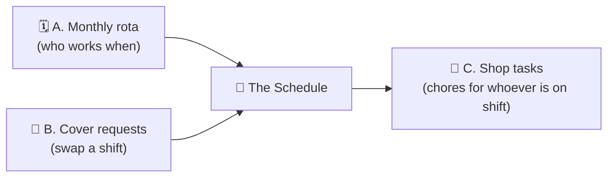
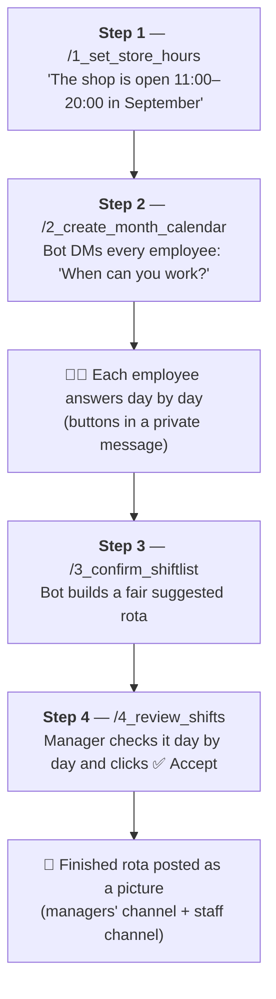
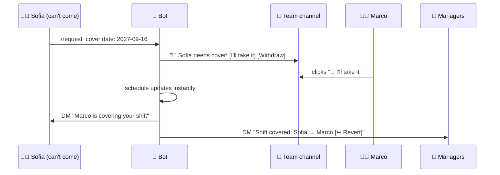
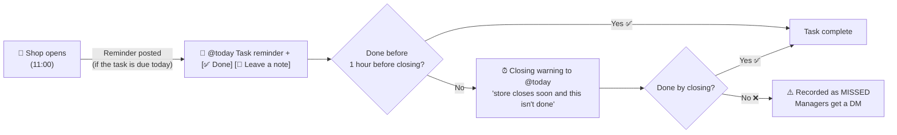

# 🏬 HBB Bot — How It Works

> **A Discord bot that runs a shop's work rota and daily chores, so managers don't have to.**
> This page explains every feature, the full workflow, and shows examples — in plain words.
>

---

## 📖 Table of contents

1. [What is this bot? (the 30-second version)](#1--what-is-this-bot-the-30-second-version)
2. [Who does what](#2--who-does-what)
3. [The big picture](#3--the-big-picture)
4. [Part A — Building the monthly rota](#4--part-a--building-the-monthly-rota)
5. [Part B — When life happens: swapping shifts](#5--part-b--when-life-happens-swapping-shifts)
6. [Part C — Shop tasks & reminders](#6--part-c--shop-tasks--reminders)
7. [Every command in one table](#7--every-command-in-one-table)
8. [Setup, safety & memory](#8--setup-safety--memory)
9. [FAQ](#9--faq)
10. [Glossary](#10--glossary)

---

## 1. 🍼 What is this bot? (the 30-second version)

Imagine a shop with a few employees. Every month someone has to answer:

- *"Who works which day, and at what time?"*
- *"Is the shop always covered by at least two people?"*
- *"Sarah can't come Thursday — who can take her shift?"*
- *"Did someone water the plants / mop the floor today?"*

Normally that's a messy pile of WhatsApp messages and spreadsheets.

**HBB Bot does all of it inside Discord.** You talk to it with **slash commands** (like `/my_calendar`) and **buttons** (like ✅ Accept). It:

| It… | So that… |
|---|---|
| 📩 **Asks every employee** which days they can work | Nobody has to chase anybody |
| 🧠 **Builds a fair rota automatically** | Everyone gets close to the hours they asked for |
| 🤖 **Suggests who should fill any gap** | A short-staffed day is fixed in one click |
| 👀 **Lets a manager review it day by day** | A human always has the final say |
| 🖼️ **Draws the rota as a picture** | Everyone can see it at a glance |
| 🙋 **Handles "can someone cover me?"** | First person to click takes the shift |
| 🔔 **Reminds people of shop chores** | Things don't get forgotten |
| 📊 **Reports who did (and missed) what** | Managers see the truth at month end |

---

## 2. 👥 Who does what

There are only **two kinds of people** for the bot:

| Role | Who | What they can do |
|---|---|---|
| 👑 **Shift Manager** | A small, fixed list of people (the bosses) | Everything — set hours, build & approve the rota, fix mistakes, see reports |
| 🧑‍💼 **Employee** | Everyone with the shop's **staff role** in Discord | Say when they're free, view their schedule, ask for cover, do tasks |

### 🪪 The staff role — hiring without touching anything

The staff list is **read from a Discord role**. Whoever has the staff role is on the rota; nobody else is.

- **Hired someone?** Give them the staff role. That's it. The bot picks them up automatically — at the latest when the next month is planned, and straight away if they use a staff command.
- **Someone left?** Take the role away. They won't be asked or scheduled again (shifts they already have stay until a manager changes them).
- **A manager who also works shifts** needs the staff role too.
- **The shop's shared account** (*Store Mac*) has the role but is **never scheduled** — the bot skips it on purpose.

If a non-manager tries a manager-only command, the bot simply answers **"❌ Access denied"**.

---

## 3. 🗺️ The big picture

The bot has **three jobs**. They are independent, but share the same calendar.


```mermaid
flowchart LR
    A["🗓️ A. Monthly rota<br/>(who works when)"] --> C["📅 The Schedule"]
    B["🙋 B. Cover requests<br/>(swap a shift)"] --> C
    C --> D["🔔 C. Shop tasks<br/>(chores for whoever is on shift)"]
```

- **A. Monthly rota** → build the month once, at the end of the previous month.
- **B. Cover requests** → happen any time during the month.
- **C. Tasks** → run automatically every single day while the shop is open.

The bot also **remembers everything** in a file on the computer where it runs, so if it restarts, nothing is lost.

---

## 4. 🗓️ Part A — Building the monthly rota

This is the heart of the bot. It is a **4-step recipe**. The commands are even **numbered** so you can't get the order wrong.


```mermaid
flowchart TD
    S1["<b>Step 1</b> — /1_set_store_hours<br/>'The shop is open 11:00–20:00 in September'"]
    S2["<b>Step 2</b> — /2_create_month_calendar<br/>Bot DMs every employee: 'When can you work?'"]
    E["🧑‍💼 Each employee answers day by day<br/>(buttons in a private message)"]
    S3["<b>Step 3</b> — /3_confirm_shiftlist<br/>Bot builds a fair suggested rota"]
    S4["<b>Step 4</b> — /4_review_shifts<br/>Manager checks it day by day and clicks ✅ Accept"]
    DONE["🎉 Finished rota posted as a picture<br/>(managers' channel + staff channel)"]
    S1 --> S2 --> E --> S3 --> S4 --> DONE
```

### Step 1 — Tell the bot when the shop is open

The manager types:

```
/1_set_store_hours  year: 2027  month: 9  opening: 11:00  closing: 20:00
```

The bot is forgiving with times: `9`, `9:30`, `09:00`, `9.5` all work.
It answers:

> ✅ **Store hours set for September 2027**
> Opening: 11:00
> Closing: 20:00
> You can now create the month calendar with `/2_create_month_calendar`

> 💡 *Why first?* Everything else (shifts, task reminders, "are we staffed?") is measured against opening hours.
> Forgot to set them for a new month? Task reminders keep running on the previous month's hours until you do.

---

### Step 2 — Ask everybody when they can work

```
/2_create_month_calendar  year: 2027  month: 9
```

The bot first re-reads the **staff role** (so anyone hired since last month is included), then:

1. A **status message** appears in the managers' channel, showing who has answered and who hasn't (it updates as people submit).
2. Every employee gets a **private message (DM)** from the bot.

#### What the employee sees (one day at a time)

```
📅 2027-09-14 (Tuesday) - Day 14/30
Store hours: 11:00 - 20:00

_Not answered yet_

[ ✅ Available ]  [ ❌ Not available ]  [ ⭐ Custom hours ]
[ ⬅️ Back ]
```

| Button | Meaning | Example |
|---|---|---|
| ✅ **Available** | "Use me any time that day." | Sofia is free all Tuesday |
| ❌ **Not available** | "Don't schedule me." | Marco has a dentist appointment |
| ⭐ **Custom hours** | "Only these hours." | Luca can only do 14:00–18:00 |

**⭐ Custom hours** opens a little form. You can type it many friendly ways:

```
14:00-18:00          ← normal
14-18                ← short
14:00 – 18:00        ← with spaces / fancy dash
11:00-13:00, 17:00-20:00   ← a split day (up to 3 blocks)
```

You can press **⬅️ Back** to change a previous day.

After the last day, the bot asks for two **monthly targets**:

| Question | Example answer | Why it matters |
|---|---|---|
| **Preferred total hours** for the month | `120` | The bot tries to get close to this |
| **Max days per week** (1–7) | `4` | The bot will never go above this on purpose |

Then: **"✅ Preferences submitted successfully! Thanks."** 🎉
The bot even tells them their *most frequent days* based on their answers.

> 🔁 Changed your mind, or the bot restarted? Use `/submit_preferences` to reopen your form. It **continues from the first unanswered day** — no progress lost.

#### When everybody has answered

The bot automatically:

- 📩 DMs the managers: *"All employee preferences submitted! Use `/3_confirm_shiftlist`…"*
- 🖼️ Posts an **availability picture** — a calendar showing who is free when. (If someone is away for two weeks, you *see* it instantly instead of reading 30 answers.)

---

### Step 3 — Let the bot build a draft

```
/3_confirm_shiftlist  year: 2027  month: 9
```

The bot thinks for a few seconds, then posts a summary like:

> ✅ **Suggested shift list generated for September 2027**
>
> 30 day(s) processed, aiming for 2 staff on the floor at all times.
>
> ⚠️ **2 day(s) fall below 2 staff** for at least part of the day:
> • Tue 14 Sep: 15:00–16:00 (1/2)
> • Tue 21 Sep: 15:00–16:00 (1/2)
> During review each of those days shows who the bot suggests to cover it — fill them with **🪄 Fill all gaps**, or pick someone with **➕ Add employee**.
>
> Run `/4_review_shifts` to review and accept.

The important rule: **at least 2 people must be in the shop at every minute it is open.**

How the bot builds it:

- ⭐ **Custom hours are placed first** — they're a promise the employee made, so the bot never moves them.
- 🧩 **Divided days are normal.** If Marco can only do 11–13 and 17–20, the bot gives the middle of the day to someone else, so the shop is still covered by two people throughout.
- ⚖️ **Fair hours.** Each gap goes to whoever is furthest behind *their own* target. When the month is built, a final pass hands whole days from anyone ahead of their share to anyone behind it who was free that day — so nobody ends up with too many hours while a colleague who was free gets too few. "Behind" is measured against each person's own target, so someone asking for 60h isn't pushed up to match someone asking for 160h.
- 🛑 **Limits are respected.** Nobody is scheduled on a day they said ❌, outside their ⭐ hours, or past their max days per week.

If the bot *can't* reach 2-at-all-times without breaking those rules, it **doesn't cheat** — it leaves the hole and **warns the manager**, and the review screen suggests who could fill it.

> 📝 This is only a **suggestion**. Nothing is official yet. Running Step 3 again rebuilds only the days that haven't been accepted.

---

### Step 4 — The manager reviews, day by day

```
/4_review_shifts  year: 2027  month: 9
```

The manager gets **one message that changes as they click** — it walks through the month one day at a time. Here's what a day looks like:

```
📅 2027-09-14 (Tuesday) — Day 14/30
🏬 Store open 11:00–20:00
━━━━━━━━━━━━━━━━━━━━
STAFF AVAILABILITY
✅ All day: Sofia · Luca
⭐ Only: Marco 11:00-16:00 · Anna 16:00-20:00
❌ Off: Paul

BOT SUGGESTION
`11:00-16:00`  Marco
`13:00-17:00`  Sofia
`16:00-20:00`  Anna
⚠️ Short-staffed: 11:00–13:00 (1/2), 17:00–20:00 (1/2)

🤖 SUGGESTED COVER
`11:00–13:00` → Luca 11:00-13:00
`17:00–20:00` → Sofia 17:00-20:00
🪄 fills them all at once, or ➕ one at a time.

━━━━━━━━━━━━━━━━━━━━
THIS WEEK (Mon 13 Sep – Sun 19 Sep)
week (+today) • week/goal • month/goal • days/max
• Sofia: 13h (+4h) • 9/21h • 9/90h • 1/4
• Luca: 9h • 9/18.7h • 27/80h • 1/3
• Marco: 5h (+5h) • 0/16.3h • 9/70h • 0/5
• Anna: 4h (+4h) • 0/14h • 9/60h • 0/4
• Paul: 0h • 0/16.3h • 0/70h • 0/4

[ ✅ Accept ] [ ➕ Add employee ] [ ⬅️ Previous day ] [ ⏭️ Next day ] [ 🪄 Fill all gaps (2) ]
[ ➕ Luca 11:00-13:00 ] [ ➕ Sofia 17:00-20:00 ] [ ✏️ Marco ] [ ✂️ Marco 11:00-16:00 ] [ ✏️ Sofia ]
[ ✂️ Sofia 13:00-17:00 ] [ ✏️ Anna ] [ ✂️ Anna 16:00-20:00 ]
```

*(This is a real review screen produced by the bot, with example names.)*

#### The three parts of each day

| Part | What it tells you |
|---|---|
| **STAFF AVAILABILITY** | What **every** employee said for this day: ✅ free all day, ⭐ only certain hours, ❌ off, ❔ never answered. Everyone on the staff list appears here exactly once. |
| **BOT SUGGESTION** | Who works which hours — **one line per person**, earliest start first (a split day stays on one line: `11:00-13:00 + 17:00-20:00  Marco`). Always the *current* state: the bot's plan until you edit it, your version after. If any stretch has fewer than 2 people, a **⚠️ Short-staffed** line names it. A day that was already accepted says **ASSIGNED** instead. |
| **🤖 SUGGESTED COVER** | Only on short-staffed days: who the bot would put on each gap, and what hours. |

If someone is scheduled **beyond what they offered** (on a day they said ❌, or outside their ⭐ hours — usually a deliberate manager fix), a line says so: *"⚠️ Scheduled beyond their availability: Paul"*.

#### 🤖 How the cover suggestions are chosen

The bot's main job on a short day is to **tell you who can fill it**:

- It will **reach past weekly limits** — hours *and* days — because a covered shop with someone on an extra day beats an empty one. Every limit a suggestion breaks is printed next to it, so you decide with that in view. For example, when the only person free has already used their one day that week:

  ```
  🤖 SUGGESTED COVER
  `11:00–20:00` → Paul 11:00-20:00 · ⚠️ 2/1 days this week
  ```
- It prefers, in order: people who **break no limits**, then people **free all day**, then people who **didn't answer**, then people **outside their ⭐ hours** — and among those, whoever has worked least this week.
- It **never** suggests someone who said ❌ *not available*. (You can still add them yourself with ➕ Add employee.)
- A gap needing two more people gets two different people; a short gap goes to someone already working next to it, so it just extends their shift.

#### What each button does

| Button | What happens |
|---|---|
| ✅ **Accept** | Makes that day **official** and moves to the next day |
| ⏭️ **Next day** | Moves on **without** accepting (the suggestion stays a suggestion) |
| ⬅️ **Previous day** | Goes back |
| 🪄 **Fill all gaps** | Applies **every** 🤖 suggestion for the day in one click |
| ➕ **Name 11:00-13:00** | Applies just **that one** suggestion |
| ➕ **Add employee** | Put anyone on the day yourself. The bot's suggested person is listed first (🤖), and the hours box is **pre-filled with every gap** they're free for — so covering a morning *and* an evening hole is one submit. Delete what you don't want. |
| ✏️ **Name** | Retype that person's whole day — or clear it to take them off |
| ✂️ **Name 11:00-16:00** | **Split** a shift: carve out part of it and hand it to someone else |

> 🛡️ Clicking twice by accident is safe — a second ✅ Accept from a screen that has already moved on just refreshes it, it never skips a day. And only the manager who opened a review can click its buttons.

#### Reading the weekly summary

One line per person, in this order:

`Name: week total (+today) • week / weekly goal • month / monthly goal • days / max days`

Example: **`Sofia: 13h (+4h) • 9/21h • 9/90h • 1/4`**

- **13h (+4h)** — her week *if today is accepted*, with today's part in brackets.
- **9/21h** — hours already accepted this week, against her weekly share of her monthly target.
- **9/90h** — hours already accepted this month, against her monthly target.
- **1/4** — days already accepted this week, against her max days per week.

**⚠️ warnings** appear only when something deserves a look:

| Where | Means |
|---|---|
| after the **week** | More than **one full store day** over her weekly share. (Shifts come in whole days, so being one shift over the exact share is normal rounding, not overwork.) |
| after the **month** | Over her monthly target. |
| after the **days** | She has used all her days for the week. |

**Weeks that cross two months** (e.g. Mon 30 Aug – Sun 5 Sep) count **days** across the whole Monday–Sunday week, and say where they came from: `4/4 (1 in Aug)`. **Hours** stay within the month, since each month's target is separate.

#### A split-shift example ✂️

*Problem:* Sofia works 13:00–17:00, but she needs to leave at 15:00.

1. Manager clicks **✂️ Sofia 13:00-17:00**.
2. A form asks *"Where do you want to split?"* → types `15:00`.
3. A menu asks *"Who takes 15:00–17:00?"* → picks Luca.
4. ✅ Sofia now works 13:00–15:00, Luca works 15:00–17:00.

Every change **updates the gap warnings, the suggestions and the weekly totals immediately**.

> 🛟 **Safety net:** while a day is still a suggestion, edits only change the *draft*. If you mess up, just don't accept it. And even accepted days can still be fixed later — the bot keeps the hour counters in step.

#### When the last day is done 🎉

The bot posts in the managers' channel:

> ✅ **September 2027 review complete** — the finished month is attached.
>
> **FINAL MONTH TOTALS (committed):**
> • **Sofia**: 88.0h confirmed / target 90.0h
> • **Luca**: 79.0h confirmed / target 80.0h
> • **Marco**: 70.0h confirmed / target 70.0h
>
> Need it again later? `/generate_image_calendar`.

…with the **whole month as a colour-coded picture** attached (each person has their own colour; a split day is stacked inside one box), and a **⬅️ Back to last day** button in case it was finished by mistake.

📣 **The same message and picture is also posted in the staff channel**, so everyone sees the final rota — without the manager-only bits (the `/generate_image_calendar` hint and the back button). If the manager goes back, changes something and finishes again, the staff channel gets the new version marked **(updated)**; finishing again without changes posts nothing.

---

### 🔧 Manual fixes at any time

Not everything needs the review screen. Two quick commands for managers:

```
/5_assign_shift  date: 2027-09-14  employee: @Sofia  start: 9  end: 13
/6_remove_shift  date: 2027-09-14  employee: @Sofia  start: 11  end: 13
```

- `5_assign_shift` **adds** hours. If the person already works that day, it **extends** it (so you can build a split day block by block).
- `6_remove_shift` **removes** hours. Leave start/end empty to take them off the whole day, or give a range to remove only part of it.

### 👀 Everyday viewing commands

| Command | What you get |
|---|---|
| `/my_calendar year:2027 month:9` | Your own shifts, hours per day, and a monthly total |
| `/generate_image_calendar year:2027 month:9` | The whole team rota as a picture |

Example `/my_calendar` answer:

```
📅 Your Schedule - September 2027

2027-09-06 (Monday): 11:00-15:00 (4.0 hours)
2027-09-08 (Wednesday): 11:00-13:00 + 17:00-20:00 (5.0 hours)
2027-09-14 (Tuesday): 11:00-20:00 (9.0 hours)

Total: 18.0 hours over 3 day(s)
```

---

## 5. 🙋 Part B — When life happens: swapping shifts

*"I can't work Thursday!"* — Employees don't know **who** is free, so the bot doesn't make them guess.


```mermaid
sequenceDiagram
    participant S as 🧑‍💼 Sofia (can't come)
    participant B as 🤖 Bot
    participant T as 👥 Team channel
    participant M as 🧑‍💼 Marco
    participant G as 👑 Managers
    S->>B: /request_cover date: 2027-09-16
    B->>T: "🙋 Sofia needs cover! [I'll take it] [Withdraw]"
    M->>T: clicks "🙋 I'll take it"
    B->>B: schedule updates instantly
    B->>S: DM "Marco is covering your shift"
    B->>G: DM "Shift covered: Sofia → Marco  [↩️ Revert]"
```

### How to ask

```
/request_cover  date: 2027-09-16
                hours: 11:00-15:00        (optional — default: your whole shift)
                reason: doctor's visit    (optional — shown to the team)
```

The bot checks you *actually work* that day (and those hours) before posting, and that the day **hasn't already passed**.
You can only have **one open request per day**.

### What the team sees

```
🙋 Sofia needs cover

When: Thursday 16 September
Hours: 11:00-15:00 (4.0h)
Reason: doctor's visit

First to take it gets the shift — the schedule updates straight away.

[ 🙋 I'll take it ]  [ ✖️ Withdraw ]
```

### Rules when someone clicks "I'll take it"

The bot says ❌ if:

- it's **your own** shift (use *Withdraw* instead),
- somebody **already took it**,
- the day **has already passed** (an untaken request simply expires),
- you're **not on the staff list** (you don't have the staff role),
- you **already work overlapping hours** that day (nobody can be in two places),
- the schedule **changed** since the request (the requester no longer works those hours).

Otherwise ✅ **the shift moves immediately** — no waiting for a manager.

### After it's taken

- The message becomes: *"✅ **Covered** — Marco is working 11:00-15:00 · ⚡ Claimed in **2m 05s**"*
- Managers get a DM. It even warns **"⚠️ over their limit"** if Marco is now above his max days that week.
- Managers have a **↩️ Revert** button. If it was a bad trade, one click puts everything back and re-opens the request.
- The requester can **✖️ Withdraw** any time *before* someone takes it (a manager can too).

### 🏆 The scoreboard

Covering is a favour, and favours go unnoticed — so the bot keeps score!

```
/cover_scoreboard            ← this month
/cover_scoreboard year: 2027 month: 8
```

```
🥇 Marco — 4 cover(s), 16.0h picked up · fastest 1m 12s
🥈 Luca  — 2 cover(s),  8.0h picked up · fastest 6m 40s
🥉 Sofia — 1 cover(s),  3.0h picked up · fastest 40m 03s
```

Ranking = **most covers first**; ties broken by **who answered fastest**.

---

## 6. 🔔 Part C — Shop tasks & reminders

Besides the rota, the bot runs **recurring chores** ("water the plants", "mop the floor", "check the fridge temperature").

### The 3 kinds of task

| Kind | Who sees it | Who can do it | How it's reminded |
|---|---|---|---|
| 🌍 **Public task** | Everybody | **Anyone working that day** | Posted in the team channel, pinging `@today` |
| 🔒 **Personal task** | Only its creator + the people assigned | Those people | Private DM |
| 📋 **Advanced task** | Only the people on it (and managers) | The people assigned (managers can close) | Private DM |

> 🧠 **Simple rule:** a task with **nobody assigned** is *public*. The moment you assign someone, it becomes *personal*.

### 🏷️ The `@today` role — whoever is on shift right now

The bot keeps a Discord role called **`today`** that holds **exactly the people on the floor at this moment**:

- People **get** `@today` when their shift starts and **lose** it when it ends. Someone on a split day (11:00–13:00 + 17:00–20:00) holds it twice, with a gap in between.
- It's updated **every 5 minutes**, so a shift changed mid-day shows up within 5 minutes.
- It's created automatically the first time the bot runs (and recreated automatically if it's ever deleted or the bot moves to a new server).

**Public tasks are for `@today`, not for one named person.** The reminder pings the role — so the opening reminder reaches the people who open, and the closing warning reaches the people closing. Nobody is pinged about the shop while they aren't in it, and **anyone working that day can tick the task off**.

You can use `@today` in your own messages too, to reach whoever is working right now.

### Creating a public task

```
/create_public_task  name: Water the plants
                     frequency: Every 2 days
                     start_date: 2027-09-20   (optional)
```

Frequencies: **Daily · Every 2/3/4/5/6 days · Weekly · Monthly**.
The **start date** is handy: *"we already did it this week — start next Monday."*
The bot answers: *"✅ Public task 'Water the plants' created (Every 2 days). Anyone working that day can mark it done."*

### Creating a personal task

Same command, but add an **assignee**:

```
/create_public_task  name: Order more bags  frequency: Weekly  assignee: @Luca
```

> 🔒 Only you and Luca can ever see it. The reply itself is private too.

### 📅 How the daily reminders work

The bot checks the clock **every 5 minutes**. All timing follows the shop's opening hours from Step 1.


```mermaid
flowchart LR
    O["🏬 Shop opens<br/>(11:00)"] -->|"Reminder posted<br/>(if the task is due today)"| R["🔔 @today Task reminder + [✅ Done] [📝 Leave a note]"]
    R --> C{"Done before<br/>1 hour before closing?"}
    C -- "Yes ✅" --> OK["Task complete"]
    C -- "No" --> P["⏰ Closing warning to @today<br/>'store closes soon and this isn't done'"]
    P --> Q{"Done by closing?"}
    Q -- "Yes ✅" --> OK
    Q -- "No ❌" --> X["⚠️ Recorded as MISSED<br/>Managers get a DM"]
```

**Just two pings per day** — one at opening, one an hour before closing (only if still not done). No hourly nagging!

#### What a public reminder looks like

```
@today 🔔 Task reminder

Task: Water the plants
Date: 2027-09-21

Whoever is on shift can mark this done. If it isn't done by closing, the managers are told.

📝 Notes
• Tue 21 Sep 12:40 — Sofia: out of soil, ordered more

[ ✅ Done ]  [ 📝 Leave a note ]
```

- **✅ Done** → works only if you're **working that day** (or a manager). Otherwise: *"❌ You're not on shift today, so you can't mark this done."* — that's the link to the rota! The confirmation says who did it and **when**.
- **📝 Leave a note** → everyone can read it, and every note shows **the date and time** it was written. Great for *"out of soil, need to buy more"*. Notes are attached to the miss if the task ends up missed, so managers see *why*.

### 📋 Advanced tasks (managers only) — for real projects

For one-off jobs with a **deadline**, an **importance**, and a required **progress report**.

```
/task_advanced  name: Reorganise the stockroom
                deadline: 2027-09-30
                priority: 8           (0–10)
                assignee: @Marco
                notes: Group by brand, label every shelf
```

- The reply is **private** (even the task's name stays hidden from others).
- Assignees get a **DM every day until it's finished** — and if the deadline passes first, the reminders **keep going, marked overdue**, instead of going quiet.
- They can't just click "done" — they press **📋 Report status** and must fill in:

| Field | Example |
|---|---|
| **Written status** (required) | "Shelves 1–4 done, waiting for labels" |
| **Completion level** 0–10 (required) | `6` |

  A level of **10 = finished**: the reminders stop. Anything less keeps them going.

- Every reminder shows the **progress history with dates**, so anyone picking it up sees how it went:

```
📈 Progress: 6/10 (as of Tue 21 Sep 17:05)
• Fri 17 Sep 09:30 — Marco: 3/10 — back room counted
• Tue 21 Sep 17:05 — Marco: 6/10 — shelves 1–4 done, waiting for labels

📝 Notes so far
• Mon 20 Sep 11:12 — Luca: labels arrive Thursday
```

- The others on the task get a DM with each report.
- 🔔 **When it's finished (10/10), every manager gets a DM** — *"✅ Advanced task completed: Reorganise the stockroom"* — with who finished it, when, and their final status. (A manager who is also on the task gets that one DM, not two.)

Add more people any time with `/task_assign`.

### Managing tasks

| Command | Purpose |
|---|---|
| `/task_list` | See the shop's public tasks |
| `/task_mine` | Your private tasks: personal ones, advanced ones (with full progress), and — listed apart — tasks **you created but aren't on** |
| `/task_assign task: … user: @…` | Put someone on a task (if someone's already on it, the bot asks **➕ Add / 🔄 Replace / ❌ Cancel**) |
| `/task_unassign task: … user: @…` | Take someone off. The task list here only offers tasks that **actually have someone on them** |
| `/delete_public_task task: …` | Delete (only the creator or a manager) |

Type-ahead: when you fill in `task:` the bot shows **only the tasks you're allowed to see**. Private task names never leak to the wrong person.

> 💡 Took yourself off a task you created? It moves to *"Created by you, you're not on them"* in `/task_mine` (you still own it). Use `/delete_public_task` if it's no longer needed.

### 📊 Reports for managers

| What | When | How |
|---|---|---|
| **Missed-task alert** | Right after closing when a public task wasn't done | DM to managers |
| **Advanced task completed** | When someone reports an advanced task 10/10 | DM to managers |
| **Monthly task report** | Automatically at closing on the **last day of the month** | DM to managers (once per month) |
| `/task_report year: 2027 month: 9` | Any time — **also works in a DM with the bot** | Private answer |
| `/task_stats days: 30` | Any time | Who completed how many tasks lately |

The monthly report shows, for each person: **tasks confirmed**, **tasks missed while they were on shift**, and **days worked** — plus the dated notes left on missed tasks. Because a public task belongs to *whoever is working*, a miss is held against **the people on shift that day**.

> Personal and advanced tasks are **left out** of the miss-tracking — nobody else can see them, so nobody else can be blamed for them.

---

## 7. 📚 Every command in one table

**Legend:** 👑 = managers only · 🧑‍💼 = everyone with the staff role

### Monthly rota (in order!)

| Command | Who | What it does |
|---|:---:|---|
| `/1_set_store_hours` | 👑 | Set opening/closing time for a month |
| `/2_create_month_calendar` | 👑 | DM every employee for their availability |
| `/3_confirm_shiftlist` | 👑 | Build the suggested rota |
| `/4_review_shifts` | 👑 | Review & accept the rota day by day |
| `/5_assign_shift` | 👑 | Manually put someone on a shift |
| `/6_remove_shift` | 👑 | Take someone off a day (or part of it) |
| `/generate_image_calendar` | 👑 | Post the month's rota as a picture |

### Everyday

| Command | Who | What it does |
|---|:---:|---|
| `/my_calendar` | 🧑‍💼 | Your own shifts for a month |
| `/submit_preferences` | 🧑‍💼 | (Re)start your availability form |
| `/request_cover` | 🧑‍💼 | Ask the team to cover a shift |
| `/cover_scoreboard` | 🧑‍💼 | Who took the most shifts |

### Tasks

| Command | Who | What it does |
|---|:---:|---|
| `/create_public_task` | 🧑‍💼 | Create a recurring task (public, or personal if you assign someone) |
| `/task_advanced` | 👑 | Create a private task with deadline & status reports |
| `/task_assign` / `/task_unassign` | 🧑‍💼* | Add/remove people on a task |
| `/delete_public_task` | 🧑‍💼* | Delete a task |
| `/today` | 🧑‍💼 | Who is working today — 🟢 on shift right now (holds `@today`), ⚪ earlier or later — and today's public tasks with their status |
| `/task_list` | 🧑‍💼 | Public tasks |
| `/task_mine` | 🧑‍💼 | Your private tasks |
| `/task_report` | 👑 | Public-task report for a month (works in DMs too) |
| `/task_stats` | 👑 | Who's been completing tasks |

\* only the task's creator or a manager.

> 🔢 **Why the numbers?** Discord sorts commands alphabetically, so `1_`, `2_`, `3_`, `4_` forces them to appear **in the order you must run them**. Steps 5 and 6 are the "quick fixes" that sit next to them.

---

## 8. 🧰 Setup, safety & memory

### What's set up once

All server settings live in one clearly marked block at the top of the bot's code (*SERVER CONFIGURATION*). They only change if the bot moves to a different Discord server:

| Setting | What it is |
|---|---|
| **Server** | The shop's Discord server |
| **Managers' channel** | Review screens, availability pictures, status messages |
| **Task / cover channels** | Where task reminders and cover requests go (default: the managers' channel) |
| **Staff channel** | Where the finished rota is published for everyone |
| **Managers** | The fixed list of shift managers |
| **Staff role** | The role that puts people on the rota |
| **Excluded accounts** | Accounts with the staff role that are never scheduled (*Store Mac*) |

**Hiring and leaving never needs a code change** — it's done with the staff role in Discord (see [Who does what](#2--who-does-what)).

### Discord permissions the bot needs

- **Manage Roles**, with the bot's own role placed **above** `today` in *Server Settings → Roles* — so it can hand out `@today`.
- **Server Members Intent** switched on in the *Discord Developer Portal → Bot* — so it can read who has the staff role. (If it's ever switched off, the bot keeps using the last staff list it read and says so in its log.)
- Permission to **send messages and pictures** in the channels above, and employees must allow **DMs from server members** to get their availability form and private reminders.

### How the bot keeps your data safe

- 💾 **Everything is in one file** next to the bot. Back that file up and you back up everything.
- 🧱 **Saving is crash-proof.** The file is written in full first and only then swapped in, so a crash or power cut mid-save can never leave half a file.
- 🚫 **A damaged file is never overwritten.** If the file can't be read at startup, the bot refuses to start (and says why) rather than starting empty and wiping your months.
- 🧯 **One bad click can't take the bot down.** If something unexpected goes wrong while handling a command, that one person gets a short error message and everything else keeps running.
- 🔒 **Many people clicking at once is safe.** Clicks are handled one at a time, so two people can never change the schedule at the same instant and corrupt it.

---

## 9. ❓ FAQ

**Q: If I press ⏭️ Next day, is the day accepted?**
No. **Only ✅ Accept** makes a day official. Skipped days stay as suggestions — you can come back to them.

**Q: I regenerated the suggestion (`/3_confirm_shiftlist`) — did I lose my accepted days?**
No. Accepted days are left alone; only the not-yet-accepted ones are rebuilt.

**Q: We hired someone. What do I do?**
Give them the **staff role** in Discord. They'll be asked for availability the next time a month is planned — and they can use `/submit_preferences` straight away.

**Q: An employee hasn't answered. Can I still build the rota?**
Yes, but the bot only schedules people who marked days ✅ or ⭐. Someone who never answered won't be placed automatically — though the 🤖 cover suggestions may still propose them for a gap (marked *"didn't answer for this day"*). It's best to wait for everyone.

**Q: What if there just aren't enough people for 2-at-all-times?**
The review shows exactly which hours are short and **suggests who could cover them** — even people past their weekly limits, with the limit shown. Fill them with **🪄 Fill all gaps**, a single **➕** suggestion, **➕ Add employee**, or `/5_assign_shift`.

**Q: Why does someone show a ⚠️ in the weekly summary?**
They're more than a full day over their weekly share, over their monthly target, or out of days for the week. Accepting is fine — the mark is there so it's a decision, not a surprise.

**Q: Can I make a mistake I can't undo?**
Hard to. Un-accepted edits are just drafts; accepted days can be re-edited; covers can be **↩️ Reverted**; tasks can be deleted.

**Q: Who sees my cover request?**
The whole team channel. The manager gets a DM only once someone takes it.

**Q: Why did a task reminder not appear?**
Reminders need store hours (the month's own, or the previous month's if not set yet), a task that is *due today* (based on frequency and start date), and it must be during opening hours.

**Q: Why wasn't I pinged by `@today` this morning?**
`@today` only holds the people on shift **at that moment**. If your shift starts at 15:00, you weren't in at opening — you'll get the closing reminder instead if the task is still open.

**Q: Can someone tick a public task from home?**
No — only people **working that day** (or managers). That's on purpose: whoever's in the shop does the chores.

**Q: Where does it save data?**
In one local file next to the bot. Back that file up and you back up everything.

---

## 10. 📖 Glossary

| Word | Meaning |
|---|---|
| **Slash command** | Something you type starting with `/`, e.g. `/my_calendar` |
| **Button** | A clickable box under a bot message |
| **DM** | Direct (private) message |
| **Modal / form** | The little pop-up window with text boxes |
| **Ephemeral** | A reply only *you* can see |
| **Rota / roster** | The schedule of who works when |
| **Staff role** | The Discord role that puts someone on the rota |
| **Shift** | One person's working hours on one day |
| **Block** | One continuous stretch of a shift (a split day has 2 or more) |
| **Divided day** | A day covered by several people in different time slots, e.g. a morning person and an evening person |
| **Gap** | A stretch of time with fewer than 2 people scheduled |
| **Suggested vs. committed** | *Suggested* = draft. *Committed* = accepted, official |
| **Cover** | Someone else working your shift |
| **`@today`** | A Discord role the bot keeps filled with whoever is on shift right now |
| **Public task** | A chore for `@today` — not given to anyone in particular; anyone working that day can do it |
| **Personal / advanced task** | Private jobs tied to specific people |

---

<p align="center">
  <b>HBB Bot</b> — built to make the rota boring, so people can get on with running the shop. 🏬<br/>
  <i>This page is documentation only. Made by Rickyita.</i>
</p>
